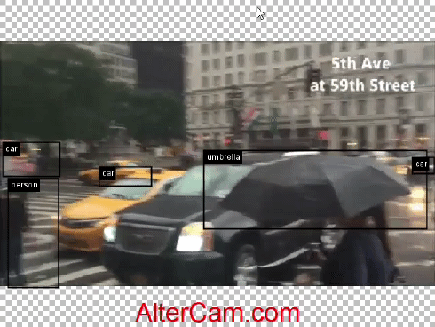

# Kotlin DL Examples

#### This repo contains a practical example on using kotlin dl for real world application

---

- ### Live CV

1. #### [Pose Detection][1] ([MoveNetLighting][2])

   [1]:src/main/kotlin/live_cv/pose_detection
   

   [2]:src/main/kotlin/live_cv/pose_detection/MoveNetLighting.kt

2. #### [Object Detection][3] ([SSDMobileNetV1][4], [SSD][5], [EfficientNetB4][6], [Resnet18V2][7])

   [1]:src/main/kotlin/live_cv/pose_detection
   

[3]:src/main/kotlin/live_cv/object_detection

[4]:src/main/kotlin/live_cv/object_detection/SSDMobileNetV1.kt

[5]:src/main/kotlin/live_cv/object_detection/SSD.kt

[6]:src/main/kotlin/live_cv/object_detection/EfficientNetB4.kt

[7]:src/main/kotlin/live_cv/object_detection/ResNet18v2.kt

3. #### Word Detection (Coming Soon)


4. #### Face Detection (Coming Soon)


- ### NLP 
1. #### [Sentiment Analysis][1] ([DistilBertUCSST2EN][2])
   
   [1]:src/main/kotlin/nlp/sentiment_analysis
   [2]:src/main/kotlin/nlp/sentiment_analysis/DistilBertUCSST2EN.kt
### Bench (Runtime)

----


- #### Intel® Core™ i5-8250U (CPU only)


| Models                    | Frequency(Hz) | Frequency(Hz) |       
|---------------------------|---------------|---------------|
|                           | On Battery    | AC            |
| `MoveNetLighting(CV)`     | ~9.5 Hz       | ~12.5 Hz      |
| `SSDMobileNetV1(CV)`      | ~4.04 Hz      | ~5.293 Hz     |
| `SSD(CV)`                 | ~0.1 Hz       | ~0.2 Hz       |
| `EfficientNetB4(CV)`      | ~2 Hz         | ~3 Hz         |
| `Resnet18v2(CV)`          | ~4.472595 Hz  | ~6.7 Hz       |
|                           |               |               |
| `DistilBertUCSST2EN(NLP)` | ~0.05 Hz      | ~0.12 Hz      |

### Run the Classes from Gradle CLI

-------

#### Tasks

`runMoveNetLighting`
\
`runSSD`
\
`runSSDMobileNetV1`
\
`runEfficientNetB4`
\
`runResNet18v2`
\
`runDistilBertUCSST2EN`(doesn't take any argument)
#### Id

The id used to specify the index of the current web cam (only for live cv)

```shell
# gradle task --args id
gradle runMoveNetLighting --args 0
```